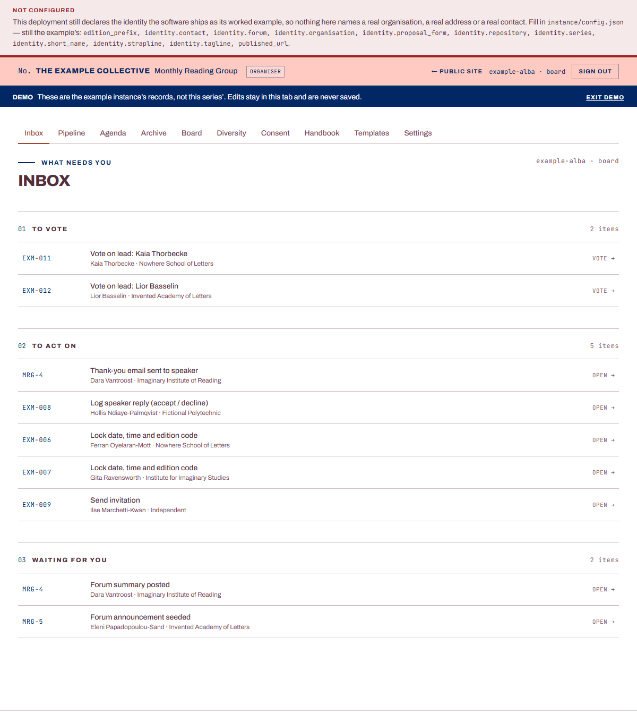
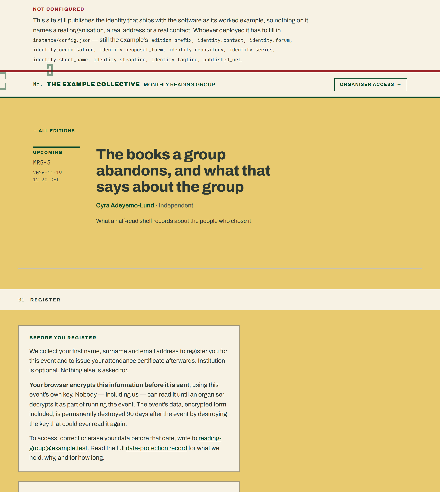
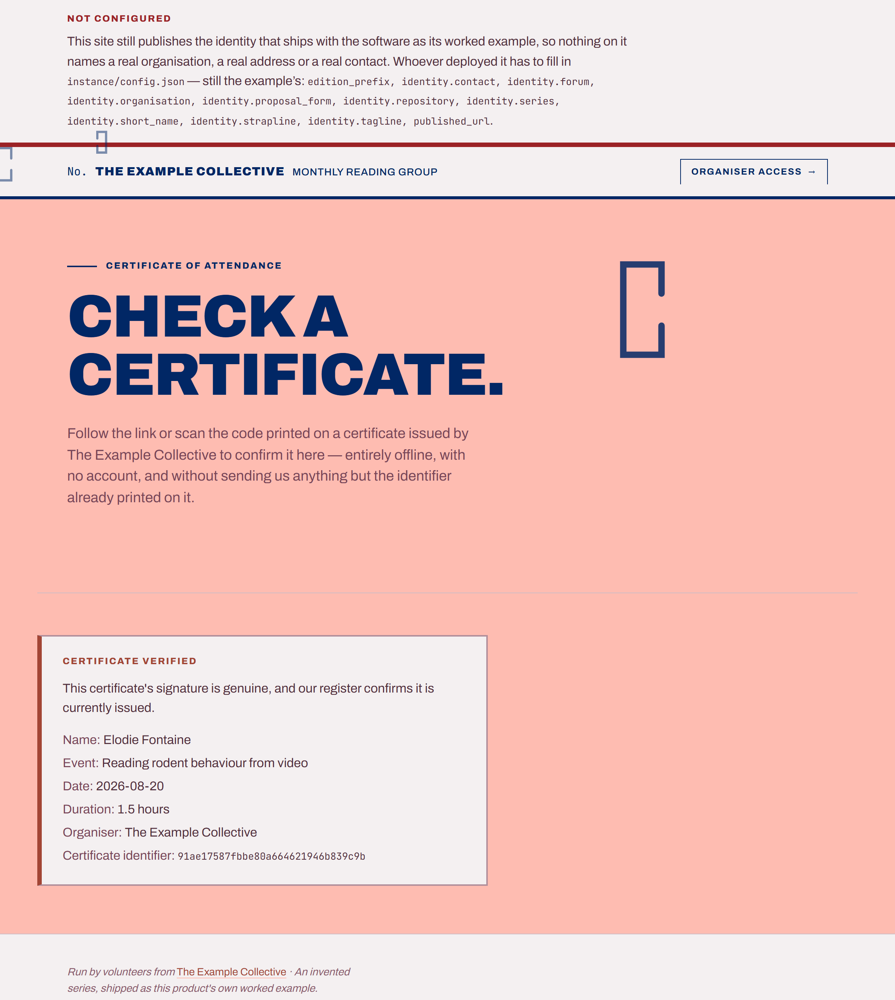

# Convener

**Convener runs a scholarly seminar series end to end — proposals, an
editorial board's votes, invitations, registration, attendance, verifiable
certificates, and the destruction of participants' personal data on a
deadline — for the volunteer-run societies, reading groups and departmental
seminars that have nobody to pay and nothing to pay them with.**


## What it looks like

**The cockpit**, where a volunteer or a board member works. This is the
demonstration mode: no account, no repository, the example instance's own
invented records.



**A public event page.** One per edition, generated — nobody writes these.
The registration form on it encrypts what a participant types before it
leaves their browser.



**The verification page.** Anyone holding a certificate can confirm it,
years later, without an account and without sending anybody the certificate
itself.



[](LICENSE)
[](docs/engineering/architecture.md)

## Seeing it run

There is nothing hosted to click. The product repository publishes no site
of its own, deliberately, so the demonstration runs on your own machine —
from a real build, with no account and no data of anybody's:

```bash
cd app && npm install && npm run dev
```

Open the address it prints, with `?demo=1` on the end. The records are the
example instance's, edits stay in the tab, and nothing is ever saved.

> [!WARNING]
> **Do not fork this repository — duplicate it.**
>
> GitHub offers *Fork* as the obvious action, and it is the wrong one here.
> An instance holds
> participants' names, addresses and affiliations, so the repository
> holding it has to be private — and:
>
> 1. **A fork of a public repository cannot be made private.** GitHub does
>    not offer the change.
> 2. **Repositories in one fork network share an object store.** A commit
>    pushed to a fork stays reachable from the public parent — permanently,
>    by anyone holding or guessing its hash, and after the fork is deleted.
> 3. So a private-looking fork holding a registration file publishes it by
>    a route nobody would think to check, and no setting inside that fork
>    closes the route.
>
> **Duplicate instead**: a new *private* repository of your own, holding
> these contents, with no fork relationship to this one.
> [D-15](docs/engineering/decisions/d-15-publication-topology.md) has the
> reasoning in full.

## Installing

An instance is a duplicate of this repository, three files edited, and a
handful of accounts that all have a free tier this project fits inside.

- **[Standing up an instance](docs/operating/standing-up.md)** — the whole
  path from no repositories and no accounts to a running instance, step by
  step, walkable with a web browser and a text editor.
- **[What a duplicate edits](docs/operating/what-a-duplicate-edits.md)** —
  six files, and what everything else is that nobody has to touch.
- **[The same sequence, written for an
  agent](docs/operating/standing-up-for-an-agent.md)** — if you work with one. Both
  it and the guide are generated from `STANDING-UP.yml`, so an agent cannot
  shorten the work by getting ahead of the browser route.
- **[What each release asks of you](CHANGELOG.md)** — an update is a merge,
  so every entry names the paths a release reached that are yours rather
  than upstream's, and what to do about each.

## What the architecture is for

Two facts about the people who run these series decide almost everything
here. **The work is unpaid and there is no budget**, so there is no
database, no server and no subscription: the repository is the store,
continuous integration is the compute, and three small edge workers hold
the three things that have to answer continuously. **Whoever does the work
changes every year or two, and is a researcher rather than an engineer**, so
a handover is a repository transfer rather than a migration, a volunteer's
instructions render beside the button they apply to, and a control that only
works when somebody remembers to run it is treated as no control at all.
Knowing a little GitHub is the whole prerequisite.

[**How it is built**](docs/engineering/architecture.md) is the full picture:
the two applications and the public showcase, where a participant's personal
data goes and when it stops being readable, and the handover procedure.
[**The decision records**](docs/engineering/decisions/index.md) are one per
structural choice, with what was rejected and what it costs. Every tracked
directory, with its owner and what it holds, is [one generated
table](docs/engineering/architecture.md#every-directory-and-who-owns-it): a
directory added without a row fails the build.

### Which documentation is yours

`docs/` is three trees, one reader each, and each opens with what it holds
and what it does not:

- [**`docs/handbook/`**](docs/handbook/index.md) — for a volunteer running a
  webinar.
- [**`docs/operating/`**](docs/operating/index.md) — for the operator
  standing an instance up and keeping it running.
- [**`docs/engineering/`**](docs/engineering/index.md) — for somebody
  changing this code, or deciding whether to build on it.

## Licence, and what you take on

Free software under the [GNU Affero General Public License, version 3 or
later](LICENSE). Section 13 of it is the point: a hosted, *modified* version
has to offer its source to the people using it, so this cannot quietly
become somebody's closed fork. If those terms do not suit your use, a
separate licence can be negotiated with the copyright holder. The name and
the mark are not covered by that grant — [`TRADEMARK.md`](TRADEMARK.md) says
what a fork renames.

**[What you take on](docs/operating/what-you-take-on.md)** is the other half
and is worth the five minutes: run an instance and *you* are the data
controller, not the author of this software; this software destroys
cryptographic keys deliberately and on a schedule, with no recovery and no
escrow; and it comes with no warranty of any kind.

**Provided as is. Issues are read. No response is guaranteed** — one unpaid
person, with a day job. [`CONTRIBUTING.md`](CONTRIBUTING.md) says what a
pull request certifies and which gates it has to leave green;
[`SECURITY.md`](SECURITY.md) has a private channel for a vulnerability, and
says what it does and does not promise; [`CITATION.cff`](CITATION.cff) is
behind GitHub's *Cite this repository* button, which for the audience this
is written for is worth more than any clause of the licence.
