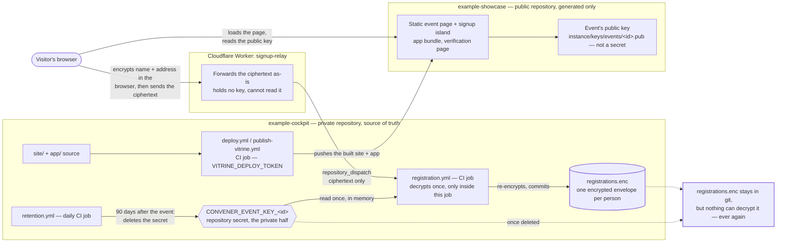

# Architecture

This project runs a volunteer-run series of academic webinars. Which
series, under whose name, is the instance's own answer and lives in
`instance/config.json`; everything below describes the system, which is
the same whoever runs it. This system is the series' operational
workspace: finding a
speaker, running the editorial board's approval process, preparing and
hosting a webinar, taking registrations, and — afterwards — matching
attendance and issuing a signed certificate. It also serves the public
showcase a visitor sees: the event pages, the registration form, and the
page that confirms a certificate is genuine.

There is no database and no third-party backend. The repository itself is
the store: everything the system needs to run is a file in git, and every
change is a commit. That single decision is why so much of what follows —
the two-repository split, the encrypted-envelope shape, the certificate
signature — reads as "work around not having a server" rather than "add a
server".

Two audiences are served, at parity:

- **Volunteers and the editorial board**, through the cockpit — a React
  application gated by GitHub sign-in, where a speaker is sourced, voted
  on, invited, scheduled and archived.
- **The public**, through the showcase — static pages with a couple of
  small interactive pieces: an event's own registration form, and a
  certificate's verification page.

## Two repositories, one source of truth

This repository, `example-cockpit`, is **private**: it holds the speakers' and
board members' personal data, the source for both applications, and every
workflow that ever touches a secret. `example-showcase` is **public** and holds
only what continuous integration puts there — the built showcase and the
built cockpit application, nothing hand-edited, nothing this repository
did not produce. A repository nobody can read has nothing to leak; a
repository that holds only reproducible output has nothing worth leaking
either.

| Directory | What it holds |
|---|---|
| `app/` | The cockpit (React + Vite): the board's and volunteers' application, gated by GitHub sign-in. Also builds the two public *islands* — registration and certificate verification — mounted on the showcase's static pages. |
| `site/` | Source of the public showcase (Eleventy): the home page, one page per event, the archives, the speaker-proposal entry, and the data notice. |
| `tools/` | `convener_ops`, the Python package every automated workflow runs: data validation, the public-data filter, matching attendance, issuing and revoking certificates, the retention sweep. |
| `services/` | Three small Cloudflare Workers with no server of their own to maintain: `auth-proxy` relays a volunteer's GitHub sign-in; `form-relay` turns a speaker-proposal submission into a commit; `signup-relay` does the same for a registration or a survey response. |
| `instance/` | Everything this series owns rather than the code: the store itself under `data/` (speaker and event records, board configuration, and — per event — an encrypted registration file and an encrypted survey-response file), the published public keys under `keys/`, what the instance publishes about itself under `public-data/`, and the four declarations a maintainer edits. `config/boundary.yml` is what says so, and `tools/tests/test_instance_directory.py` is what keeps it true. |
| `config/` | The product's own declarations, which the cockpit never reads: the external integrations the code knows about, and `boundary.yml`, which names the paths the instance owns. |
| `.github/workflows/` | The whole automation surface. Nothing in this system runs anywhere else. |
| `docs/` | This handbook: volunteer-facing workflow and governance pages (rendered inline by the cockpit), plus reference material like this file. |

Continuous integration in this repository builds both applications and
pushes the *output* to the published repository's root — the same GitHub
Pages setting ("branch `main`, folder root") already serves it, so nothing
needs configuring there beyond that. Which repository that is, is derived
from the address itself rather than named twice
(`published.Published.publish_repository`). Once published, the showcase
and the cockpit are reachable at:

```
https://<owner>.github.io/<repository>/               the showcase
https://<owner>.github.io/<repository>/events/<id>/   one page per event
https://<owner>.github.io/<repository>/app/           the cockpit
https://<owner>.github.io/<repository>/verify/        certificate verification
```

One declaration decides all four: `instance/config.json`. Both halves of
the address above come out of it, and so does the repository the two
publishing workflows push into — see *Operations* for how an operator sets
that up.

## What this series owns, and what anybody duplicating it would keep

This system is meant to be run by more than one group, which makes an
update a **merge**: it works only if the code and the running series live
in paths that never overlap. So "what belongs to this series" is not a
sentiment here, it is a list — `config/boundary.yml` holds it, and
`tools/convener_ops/boundary.py` reads it. Everything the list does not name
belongs to the code, and a directory is handed over whole rather than file
by file: the records and configuration under `instance/data/`, the published
public keys under `instance/keys/`, whatever continuous integration publishes into
`instance/public-data/`, the showcase's own title and addresses, and the thresholds
in `config/` that each say so in their own header.

Two files sit inside those directories and still belong to the code —
`instance/data/schema.md`, a pointer to the generated schema page, and
`instance/keys/signing/README.md`, the verification wire format. Both are named as
exceptions in the same declaration, with the reason beside the path. A
test refuses a third one nobody accounts for, and refuses source code
appearing anywhere in the handed-over paths: a bug in a file has to be
fixable upstream, which stops being true the moment the file belongs to
somebody else.

## Where a personal address lives, and when it disappears

A participant's name and address are the most sensitive thing this system
carries, so the diagram below follows that data specifically, alongside
the two repositories, the relay it passes through, and the workflows that
touch it.



Read left to right: the cockpit builds and publishes the showcase; a
visitor's browser encrypts a registration under that event's *public* key
before it ever leaves the browser, and only the signup relay — which never
holds a key and cannot read what it forwards — sits between the browser
and this repository. `registration.yml` is the only place a registration
is ever decrypted, and it happens once, inside that one CI job, from a
repository secret that never leaves it. What is committed afterwards
(`registrations.enc`) is ciphertext, encrypted again under the event's
key, one independent envelope per person.

Ninety days after the event, `retention.yml` deletes that event's private
key. Nothing is removed from `registrations.enc` — the ciphertext stays in
git, unchanged, forever — but with the key gone, nothing can ever decrypt
it again. **It is the destruction of the key that makes the data
unreadable, not the deletion of a file.** An early request to withdraw one
person's own registration is a separate, narrower operation
(`erase-registration.yml`) that removes just that one envelope, without
touching anyone else's.

## Why it is built this way

The structural choices behind this system — why two repositories, why the
data is encrypted the way it is, why an address is never an input to a
workflow, why the showcase is static with a couple of interactive islands
rather than a single application — are recorded as a set of numbered
[architecture decision records](decisions/index.md), each one naming what
was rejected and why.

This file cites a decision by its number rather than restating it, the
same discipline those records ask of every other document in this
project — a decision copied into a second place is a second thing that
can go out of date. A handful that shape what is above: no database, the
repository is the store (D-01); every integration degrades visibly when
unconfigured rather than failing (D-13); the private/public repository
split (D-15); static pages with interactive islands (D-18); an event's
identifier is its edition code (D-19); a stored registration is one
independent encrypted envelope, and only its key's destruction — never
its own deletion — makes it unreadable (D-22, D-23); and every public
address is verified in its actually-published form, not a local
convenience (D-26).

## Handover (G-11)

This project's governance requires that no account or secret ever belongs
to one person (D-11, G-11): an email address owned by the organisation,
never a volunteer's own, is the identity behind every service account;
a shared password vault kept in the organisation's own Drive — never
committed to a repository — holds every credential, and its master
password is shared out of band with several Board members, not one. Every
account created after the first is created with that address and stored
in the same vault. The point is not secrecy: it is that the person who
set this system up stopping, at any time, changes nothing about anyone
else's ability to keep running it.

G-11 says the role is transferable; it does not say what a successor is
actually handed. D-28 is that mapping onto GitHub's own permission model:
the architect is the organisation **owner**, a role independent of Board
membership, and a Board member holds repository **write**, and nothing
more. Handover is manual and deliberate — promote, verify, step down —
and D-28 states two things plainly rather than leaving them implicit: a
single owner is a bus-factor risk (a second, rarely-used owner is the
ordinary mitigation, a trade-off the maintainer decides), and an owner is
inherently a trust root, able to rewrite any secret and add themselves
anywhere. This is also the one free control this project has left over
the write-access exposure a security review found: it bounds
how long an unused write grant stays live, without ever closing what a
write grant can do.

No code change is ever needed to connect, rotate or remove an external
service — a secret is set or unset, never a line of code. Exactly which
account to create, which secret to set it under, and how to confirm it is
working, for every integration this system has, is documented in
`docs/reference/operations.md` in this repository.

## Contributing

```bash
cd app && npm install && npm run dev     # localhost, under <repository>/app/
cd site && npm install && npm start      # localhost, under <repository>/
cd tools && uv sync
```

Both dev servers serve under the path prefix `instance/config.json`'s own
`published_url` gives, never at a bare root: D-26 exists because a build
served at a bare `localhost` root passed every local check while the
deployed shape was broken.

Each of `app/`, `site/` and `tools/` carries its own tests, and `services/`
holds one small Cloudflare Worker per folder with its own. A pull request
is expected to leave every one of them green — formatting, linting,
British-English spelling, type-checking, and the test suite itself — the
same gates continuous integration runs on every push. `README.md`'s own
quickstart covers the day-to-day commands; nothing here needs an account
or a secret to run.

Handbook content — the volunteer-facing workflow and governance pages
under `docs/` — is the one part of this repository anyone can propose a
fix to without setting up a development environment at all: every page
carries an "edit on GitHub" link, and an edit becomes an ordinary pull
request.
